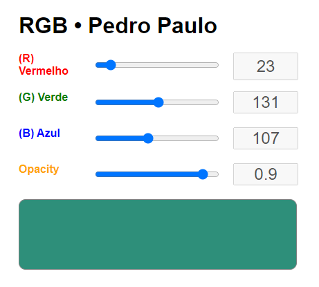

Pequeno projeto desenvolvido no Bootcamp do IGTI [Meu primeiro bootcamp]

### Objetivo

Exercitar a busca de dados de um Json via Javascript.

### Tecnologias usadas

HTML, CSS e Javascript

### Projeto final do Módulo 1 do bootcamp da IGTI

<a href="https://pedropaulodf-igti-rgb.netlify.app/" target="_blank">Veja ele no Netlify</a>

